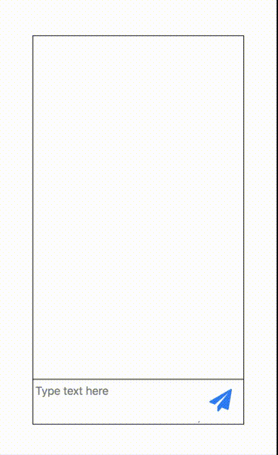

# NgChat

Simple Angular chat library



## Getting started

Create an Angular project with Angular CLI

Install package from npm

``` bash
npm install ng-ui-chat --save
```

Include module in your application

``` js
import { NgModule } from '@angular/core';
import { BrowserModule } from '@angular/platform-browser';
import { ChatModule } from 'ng-ui-chat';

@NgModule({
  imports: [
    BrowserModule,
    ChatModule
  ],
  declarations: [ AppComponent ],
  exports: [ AppComponent ]
})
export class AppModule {}
```

## Examples

In your html file :

``` html
    <chat [messages]="messages" (inputSent)="onInputReceived($event)"></chat>
```

In your ts file :

``` js
import { Component } from '@angular/core';

@Component({
  selector: 'app-root',
  templateUrl: './app.component.html',
  styleUrls: ['./app.component.css']
})
export class AppComponent {
    messages = [];

    onInputReceived(input: string) {
        const newMessage = {"text": input, "date":"", "userOwner":true};
        this.messages.push(newMessage);
        const newAnswer = {"text": "You said : " + input, "date": "", "userOwner": false};
        this.messages.push(newAnswer); 
    }
}
```

## Options

Several options are available (they all have default values) :

``` html
<chat [messages]="messages" [colorBackRight]="'#DD0000'" [colorFontRight]="'#DDDDDD'"
    [colorBackLeft]="'#00DD00'" [colorFontLeft]="'#DDDDDD'" (inputSent)="onInputReceived($event)"
    [width]="'250px'" [height]="'500px'" [border]="'1px solid black'"></chat>
```

## Author

[Simon Gheeraert](https://github.com/simonghrt)

## TODO

- [] Add tests
- [] Add examples
- [] Add date in messages
- [] More available options
- [] Make a general option object that will be passed to the element
- [] Use ng-packagr for publication
- [] Use more recent version of Angular
- [] Improve input design